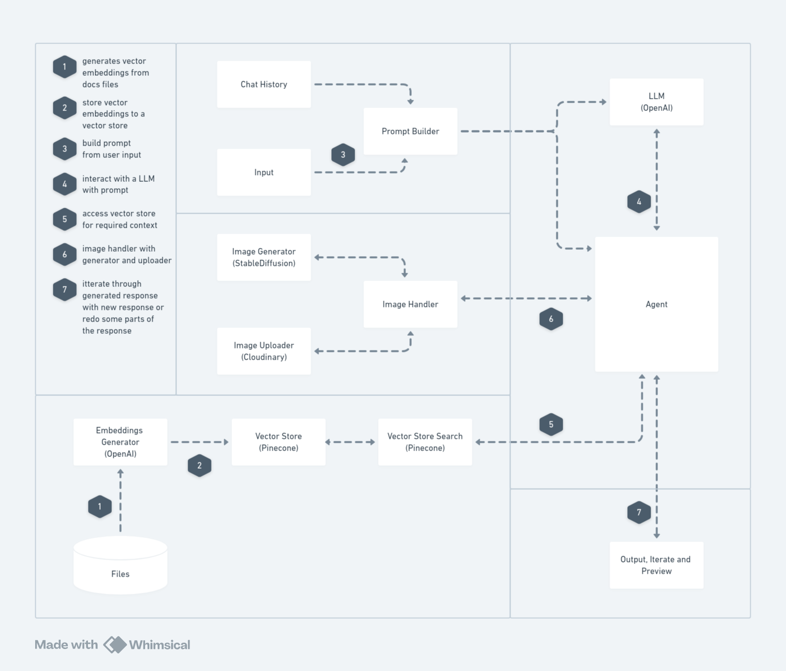

# Web-Zero  

Web-Zero is an **AI-powered website code generation tool** designed to streamline the web development process by reducing the time it takes to go from an idea to functional code.  

This tool leverages modern design systems and advanced AI technologies to provide developers with a seamless and efficient workflow.  

## Features  
- **Shadcn Components**: Uses a robust design system for consistent and elegant UI generation.  
- **Stable Diffusion Models**: Generates custom images based on user prompts.  
- **Retrieval-Augmented Generation (RAG)**: Stores examples of Shadcn component usage to enhance the tool's contextual understanding.  
- **OpenAI Function Calling**: Automatically generates structured JSON schemas to call relevant tools for image creation and component code generation.  

## Architecture  
The architecture of Web-Zero combines AI models, design systems, and agentic workflows to deliver an end-to-end website generation experience.  

  

## How It Works  
1. **User Prompt**: Input your requirements, including website layout and image preferences.  
2. **AI Processing**: Web-Zero utilizes RAG to retrieve relevant design examples and OpenAI to generate a structured JSON schema.  
3. **Tool Integration**: The JSON schema triggers tools for image generation (using Stable Diffusion) and UI code creation (using Shadcn components).  
4. **Output**: The final code and assets are compiled and delivered, ready for deployment.  

## Live Demo  
Experience Web-Zero in action: [web-zero-ui.hf.space](https://web-zero-ui.hf.space)  
